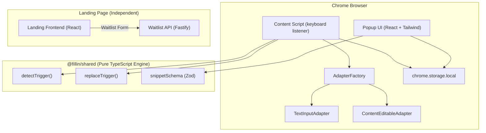

#  Fillin

> **Fill in your own blanks.**  
> Create instant shortcuts for anything you type repeatedly. Privacy-first, local-first, blazing fast.


---

##  Overview

**Fillin** is a privacy-focused Chrome Extension that expands custom text snippets natively anywhere in your browser using the `Ctrl + Space` hotkey.

Whether you're typing your email (`/email`), a canned customer support response (`/thanks`), or a multi-line code snippet (`/boilerplate`), Fillin replaces your trigger in milliseconds. It operates **100% locally on your machine**—requiring no user accounts, no cloud sync, and no third-party servers to expand text.

---

##  Key Features

-  **Instant Snippet Expansion**: Type your snippet trigger (e.g. `/email`) and hit `Ctrl + Space` to expand it inline.
-  **Universal DOM Adapters**:
  - **Standard Inputs & Textareas**: Full support for `<input>` and `<textarea>` elements.
  - **React-Controlled Fields**: Bypasses React's internal value setter override (`Object.getOwnPropertyDescriptor`) so synthetic events bubble naturally.
  - **Rich-Text & ContentEditable Editors**: Native support for complex wrappers like Notion, Gmail, and Google Docs (`isContentEditable`).
  - **Restricted Inputs**: Automatically handles cursor position calculation for HTML5 input types (`search`, `url`, `tel`).
-  **Zero Data Collection**: Operates strictly on `chrome.storage.local`. No typing data or keystrokes ever leave your browser.
-  **Minimal Popup UI**: Sleek, modern extension popup to create, edit, search, and manage shortcuts effortlessly.
-  **Decoupled Monorepo Architecture**: Clean separation between the core shared engine, the extension, and the marketing landing app.

---

##  Monorepo Architecture

Fillin is structured as a [Turborepo](https://turbo.build/) monorepo powered by `pnpm` workspaces:

```
Fillin/
├── apps/
│   ├── extension/          # Chrome Extension (React 18, Vite, Manifest V3, TailwindCSS)
│   └── landing/
│       ├── frontend/       # Marketing Landing Page (React 18, Vite, TailwindCSS)
│       └── backend/        # Independent Waitlist REST API (Node.js, Fastify, Zod)
├── packages/
│   ├── shared/             # Pure, framework-agnostic core logic & TypeScript models
│   └── config/             # Shared TypeScript and ESLint configurations
├── AGENTS.md               # Monorepo architectural rules & invariants
└── ARCHITECTURE.md         # In-depth technical architecture documentation
```

### System Component Diagram



---

##  How It Works Under the Hood

### 1. Trigger Detection Engine ([`packages/shared/src/engine/detector.ts`](file:///Users/samprati/Desktop/Projects/Fillin/Fillin/packages/shared/src/engine/detector.ts))
When `Ctrl + Space` is pressed, Fillin extracts the text preceding the cursor and scans for triggers starting with `/`:
- **Word Boundary Verification**: Ensures the trigger is preceded by whitespace, line start, or punctuation (`[\s.,;:!?()[\]{}"'<>]`), preventing accidental triggers inside URLs (e.g. `https://github.com/email`).
- **Registered Match**: Checks candidate triggers against locally cached shortcuts.

### 2. Universal DOM Adapters ([`apps/extension/src/content/adapters`](file:///Users/samprati/Desktop/Projects/Fillin/Fillin/apps/extension/src/content/adapters))
- **`TextInputAdapter`**: Reads `selectionStart`/`selectionEnd` and mutates the element's value using the native prototype setter (`HTMLInputElement.prototype.value`), dispatching a bubbling `input` event to notify React/Vue/Angular state handlers.
- **`ContentEditableAdapter`**: Interacts directly with `window.getSelection()` and DOM `Text` nodes, updating `node.textContent` and setting `Range` start/end points to maintain precise cursor position.

### 3. Local Storage Persistence ([`apps/extension/src/storage`](file:///Users/samprati/Desktop/Projects/Fillin/Fillin/apps/extension/src/storage))
Uses a repository pattern ([`SnippetRepository`](file:///Users/samprati/Desktop/Projects/Fillin/Fillin/apps/extension/src/storage/SnippetRepository.ts)) with implementations for Chrome Storage API (`chrome.storage.local`), Web `localStorage`, and an `InMemoryRepository` for unit tests.

---

##  Developer Setup & Usage Guide

### Prerequisites

- **Node.js**: `v18.0.0` or higher (v20+ recommended)
- **pnpm**: `v9.0.0` or higher (`npm i -g pnpm`)

---

### Step 1: Clone & Install Dependencies

```bash
git clone https://github.com/vishalsingh-data/Fillin.git
cd Fillin
pnpm install
```

---

### Step 2: Build the Chrome Extension

To create a production build of the Chrome extension:

```bash
pnpm --filter @fillin/extension run build
```

This compiles the extension assets into `apps/extension/dist`.

---

### Step 3: Load Extension in Google Chrome

1. Open **Google Chrome** and navigate to `chrome://extensions/`.
2. Enable **Developer mode** using the toggle in the top-right corner.
3. Click **Load unpacked** in the top-left menu.
4. Select the build directory: `<path-to-repo>/Fillin/apps/extension/dist`.
5.  **Fillin is ready!**
   - Click the extension icon in Chrome to open the popup and add a shortcut (e.g., Trigger: `/email`, Content: `yourname@example.com`).
   - Go to any text box on any webpage, type `/email`, and press `Ctrl + Space`.

---

### Step 4: Development Commands

You can run individual applications or the full monorepo in development mode:

| Task | Command | Description |
| :--- | :--- | :--- |
| **Full Monorepo** | `pnpm dev` | Runs backend, landing page, and extension simultaneously |
| **Extension Popup UI** | `pnpm --filter @fillin/extension dev` | Starts Vite dev server for popup UI development |
| **Landing Frontend** | `pnpm --filter @fillin/landing-frontend dev` | Starts landing page dev server (`http://localhost:5173`) |
| **Landing Backend** | `pnpm --filter @fillin/landing-backend dev` | Starts Fastify waitlist API (`http://localhost:3000`) |

---

### Step 5: Testing & Quality Checks

Run tests and typechecks across all packages in the workspace:

```bash
# Run unit tests across all packages
pnpm test

# Run TypeScript type-checking across all packages
pnpm typecheck

# Format code with Prettier
pnpm format
```

---

##  Privacy & Security Model

Fillin is built on a strict **privacy-first design**:

- **Zero Remote Analytics**: Keystroke detection and expansion occur entirely inside your browser tab's content script sandbox.
- **Minimal Chrome Permissions**: Requesting strictly `"storage"` permission for snippet saving. No `"tabs"`, `"cookies"`, or `"webRequest"` permissions needed.
- **Decoupled Architecture**: The extension codebase makes zero HTTP/REST calls to any backend server.

---

##  Architectural Invariants

Developers contributing to Fillin must adhere to the rules defined in [`AGENTS.md`](file:///Users/samprati/Desktop/Projects/Fillin/Fillin/AGENTS.md) and [`ARCHITECTURE.md`](file:///Users/samprati/Desktop/Projects/Fillin/Fillin/ARCHITECTURE.md):

1. **Shared Package Discipline**: `packages/shared` must remain framework-agnostic. No Chrome APIs, DOM objects (`window`, `document`), React components, or server code inside `@fillin/shared`.
2. **App Decoupling**: Extension must remain independent from the landing page and backend.
3. **Security**: Password fields (`<input type="password">`) are strictly ignored by trigger detection.

---

##  Contributing

Contributions are welcome! Please read [CONTRIBUTING.md](CONTRIBUTING.md) and [docs/development/README.md](docs/development/README.md) before submitting pull requests.

---

##  License

Distributed under the [MIT License](LICENSE).
